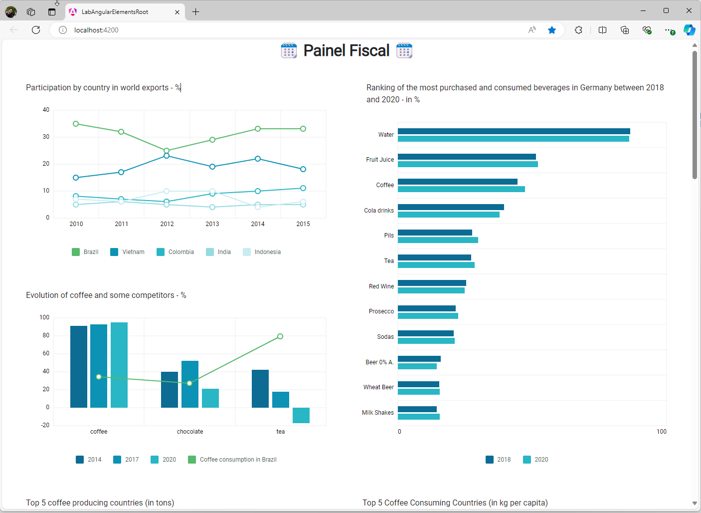
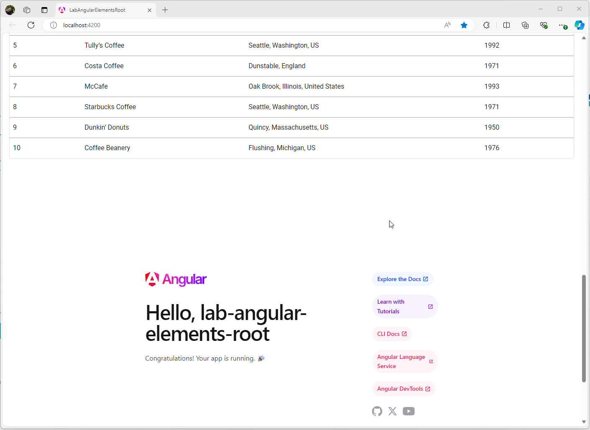

# Projeto LabAngularElementsChild

Este projeto Angular é um exemplo prático de como utilizar elementos personalizados utilizando o Angular Elements.

Os eslementos utilizados neste projeto estãos disponíveis no seguinte repositório: 
- [lab-angular-elements-child](https://github.com/ronanvaleoliveira/lab-angular-elements-child)


## Clonar

Para clonar o projeto, execute o seguinte comando no terminal:

```bash
git clone https://github.com/ronanvaleoliveira/lab-angular-elements-root.git
```


## Instalação

Para instalar as dependências do projeto, execute o seguinte comando no diretório do projeto:

```bash
npm install
```


## Executar o Projeto

- Execute `ng serve` ou `npm rum start` para executar a aplicação em um servidor de desenvolvimento. 
- Navegue até `http://localhost:4200/`. 
- O aplicativo será recarregado automaticamente se você alterar algum dos arquivos de origem.

```bash
ng serve

npm rum start
```


